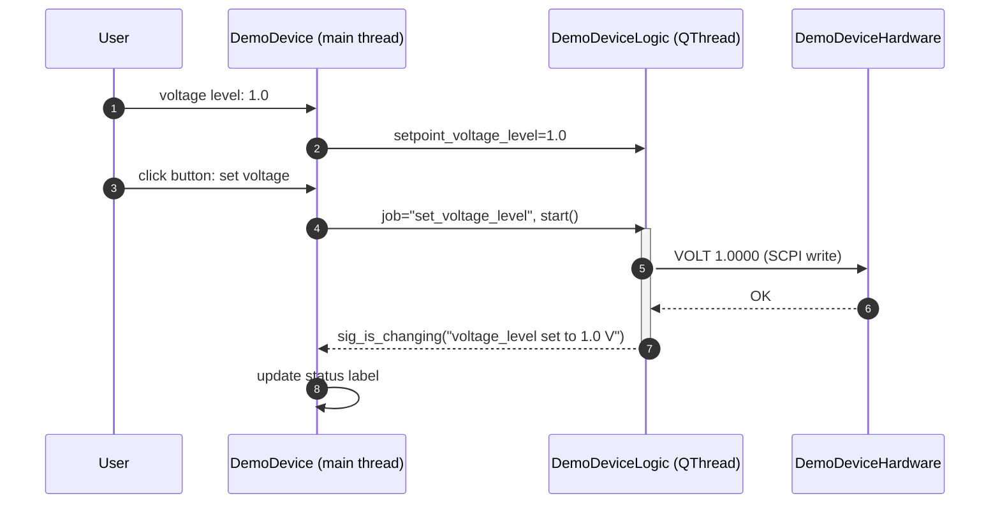
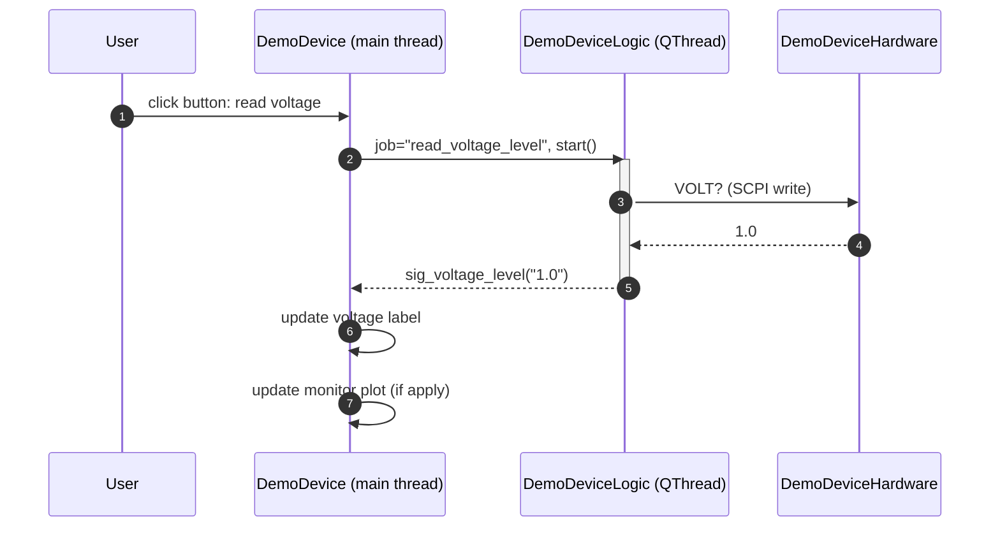
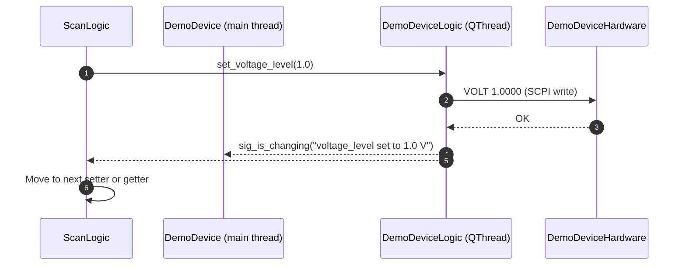
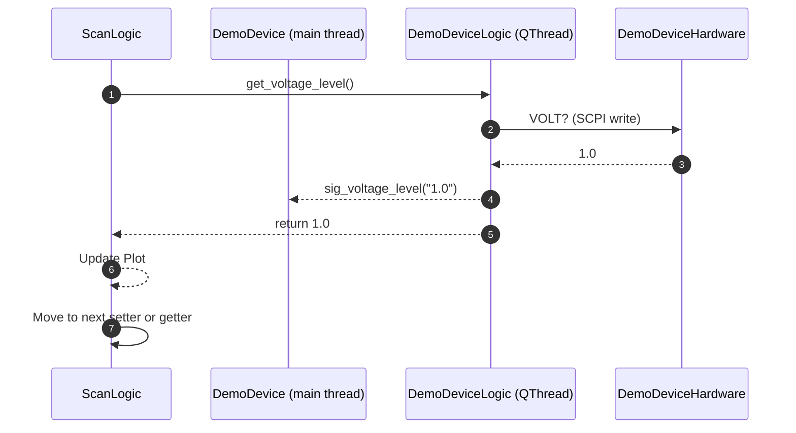

# Demo Device – Architecture Overview

This template shows how **zmeter**'s device modules are structured and how data flows from the physical instrument right up to the Qt widgets.

```
┌─────────────┐     SCPI / VISA    ┌─────────────┐        directly     ┌────────────────┐       Qt signals   ┌───────────────┐
│   Physical  │ <----------------> │   Hardware  │  <----------------> │Logic (QThread) │  <---------------> │ main (Widget) │
│  Instrument │     COM etc.       │     .py     │         call        │    .py         │                    │     .py       │
└─────────────┘                    └─────────────┘                     └────────────────┘                    └───────────────┘
```


## 1. Hardware layer – `DemoDeviceHardware`
* Located in `demoDevice_hardware.py` and inspired by real drivers such as `sr860_hardware.py`.
* Talks to the instrument **only** via [PyVISA](https://pyvisa.readthedocs.io/) – no vendor DLLs.
* Provides **symmetric** read / write helpers:
  ```python
  dev.voltage_level(1.234, write=True)   # setter
  current_v = dev.voltage_level(read=True)
  ```
* `_write()` and `_query()` centralise low-level I/O (terminators, retries, debug logging).
* A **dummy implementation** (`dummy_visa.py`) can monkey-patch `pyvisa` so the rest of the stack works without real hardware:
  ```python
  from demoDevice import dummy_visa
  dummy_visa.patch_pyvisa()  # replaces pyvisa.ResourceManager
  ```


## 2. Logic layer – `DemoDeviceLogic` (`QThread`)
The GUI must never block on I/O.  Therefore all communication happens in a worker thread:

* Sub-classes `QtCore.QThread`.
* Holds *one* `DemoDeviceHardware` instance.
* Public API consists of **get_...** and **set_...** methods.  They do *not* run immediately; instead we schedule jobs:
  ```python
  self.logic.setpoint_voltage_level = 2.5
  self.logic.job = "set_voltage_level"  # name of the worker method
  self.logic.start()                    # -> triggers run()
  ```
* Functions named with **get_...** and **set_...** will be automatically reconginzed as getter and setter in the scan code, except user specifies the desire getter and setter methods.
* `run()` is the thread entry-point.  It dispatches to the method named in `self.job` and then returns.
  current `run()` is simplified, which does same job as
  python
  if self.job == "get_xxx":
    self.get_xxx()
  elif self.job == "set_xxx":
    self.set_xxx(self.set_point_xxx)
  ...
  ```
* Emits Qt **signals** when a value changes (`sig_voltage_level`, `sig_is_changing`, ...).  Signals automatically cross the thread boundary in a thread-safe manner.
* Scan code is directly calling the function in logic layer.


## 3. GUI layer – `DemoDevice`
* Loaded from the `.ui` file created in Qt Designer.
* Reacts to user actions (button clicks, spin-box edits), converts them into **jobs** for the logic thread, and starts it.
  ```python
  def _on_voltage_changed(self, value):
      self.logic.stop()                       # stop any previous job
      self.logic.setpoint_voltage_level = value
      self.logic.job = "set_voltage_level"
      self.logic.start()                      # non-blocking
  ```
* Connects to logic signals; the slot updates Qt widgets **on the main thread**:
  ```python
  self.logic.sig_voltage_level.connect(self._update_voltage)

  def _update_voltage(self, val):
      self.voltageLevel_doubleSpinBox.blockSignals(True)
      self.voltageLevel_doubleSpinBox.setValue(float(val))
      self.voltageLevel_doubleSpinBox.blockSignals(False)
  ```
* A `QTimer` calls `_monitor()` every 500 ms (changeable) to poll the device via `logic.get_all()` – ideal for status indicators. See SR860, SR830 or nidaq for examples.

## 4. Converting the Folder to a Module

To enable the folder to be imported and run directly by `zmeter`, we need to convert it into a Python module. Follow these steps:

### Step 1: Add `__init__.py`

Create an empty file named `__init__.py` inside the folder. This tells Python to treat the folder as a module.

### Step 2: Update Internal Imports

Update the imports in your Python files to use **relative imports**.

#### In `demoDevice_logic.py`:
```python
# Old:
from demoDevice_hardware import DemoDeviceHardware

# New:
from .demoDevice_hardware import DemoDeviceHardware
```

#### In `demoDevice_main.py`:
```python
# Old:
from demoDevice_logic import DemoDeviceLogic

# New:
from .demoDevice_logic import DemoDeviceLogic
```

> 🔹 The `.` in Python imports refers to the current package (i.e., the module folder you just created), allowing Python to resolve the file correctly.

### Step 3: Import in Scan Code

Now you can import the device module in your scan code like this:

```python
from demoDevice.demoDevice_main import DemoDevice
```


## 5. Threading model in a nutshell
1. UI thread tells Logic thread what to do → `logic.job = "get_voltage_level"`; `logic.start()`.
2. Qt spawns / re-uses the QThread and calls `logic.run()` in **another thread**.
3. `run()` performs blocking VISA I/O via `DemoDeviceHardware`.
4. When finished, the logic thread emits signals → Qt delivers them to slots on the **main thread**.
5. Slots update widgets.  No locking is required because Qt guarantees signal–slot thread-safety.


## 6. Sequence example
Set Voltage Level to 1.0 Through UI

Read Voltage Level Through UI

Set Voltage Level to 1.0 by Scan Logic

Read Voltage Level Through Scan Logic



## 7. Running without hardware
All of the above work both with real PyVISA **or** after adding the following into in _hardware.py file
```python
from dummy_visa import patch_pyvisa
patch_pyvisa()
```


---
This template should give you everything needed to build a new instrument module: safe multithreading, responsive UI, and easy-to-test layers. 